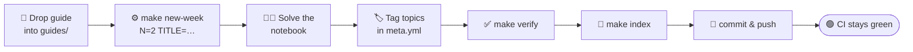

<div align="center">

# 🧪 ML Lab Logbook

### _A reproducibility-verified logbook of my weekly Machine Learning labs._

Not a folder-per-week homework dump — a **compounding, self-indexing engineering artifact**
that anyone can clone, install, and re-run to the exact same result.

<!-- Replace USER/REPO once pushed to GitHub so the badges go live. -->
[](https://github.com/USER/REPO/actions/workflows/verify.yml)
&nbsp;


</div>

---

> **The idea in one line:** every notebook is CI-proven to run end-to-end from a clean clone,
> and a single `meta.yml` per week regenerates the dashboard below — so the repo *grows itself*.

## ✨ What makes this different

|  | |
|---|---|
| 🔒 **Gradeable** | Every notebook keeps the exact name the guide demands — `lab1_<rollno>.ipynb`, `lab2_<rollno>.ipynb`, … — so it stays submittable as-is. |
| 🔁 **Reproducible** | Environment pinned with `uv.lock`; CI executes *every* notebook headless on a fresh machine. A green badge = "it really runs." |
| 🧭 **Self-indexing** | One tiny `meta.yml` per week is the single source of truth. It auto-builds the progress dashboard and cumulative cheat sheet. |
| ♻️ **DRY** | Shared helpers in [`ml_utils`](shared/ml_utils/data.py) are imported, never copy-pasted — so week 12 reuses week 1. |
| ➕ **Additive** | Adding a new week is the same ~2-minute ritual every time, whether it's week 2 or week 13. |

## 🚀 Quickstart

```bash
git clone <this-repo> && cd <this-repo>
uv sync                 # reproduce the exact locked environment
uv run jupyter lab      # open and work on the notebooks
make verify             # execute every notebook headless — the reproducibility gate
```

<details>
<summary><b>What each <code>make</code> target does</b></summary>

| Command | What it does |
|---------|--------------|
| `make install` | Install / refresh the locked environment (`uv sync`) |
| `make new-week N=2 TITLE="…"` | Scaffold a new week folder + auto-named grade-locked notebook |
| `make verify` | Run every notebook top-to-bottom from a clean kernel; fail on any error |
| `make index` | Regenerate the dashboard below + the cumulative cheat sheet |
| `make check` | Assert the dashboard is in sync (used by CI) |

</details>

## 📊 Semester progress

<!-- AUTO:START -->

### Progress

`████░░░░░░░░░░░░░░░░░░░░`&nbsp;&nbsp;**15%** &nbsp;·&nbsp; 2 of 13 weeks complete

### Weeks

| Week | Title | Datasets | Topics | Status | Notebook |
|------|-------|----------|--------|--------|----------|
| 01 | NumPy & Pandas Foundations | `load_iris`, `load_wine` | 20 topics | ✅ done | [`lab1_CB.SC.U4CSE24664.ipynb`](weeks/week01/lab1_CB.SC.U4CSE24664.ipynb) |
| 02 | Data Cleaning & Feature Engineering | `load_iris`, `load_wine` | 16 topics | ✅ done | [`lab2_CB.SC.U4CSE24664.ipynb`](weeks/week02/lab2_CB.SC.U4CSE24664.ipynb) |

<!-- AUTO:END -->

> _This section is generated by [`tools/build_index.py`](tools/build_index.py) from each week's
> `meta.yml`. Don't edit between the markers by hand — run `make index`._

## 🔁 The Monday ritual

When a new guide arrives, the same loop turns it into a verified, indexed week:



Steps ⚙️🏷️✅🔄 are the only overhead — about two minutes. Everything that gives the repo its
identity (dashboard, cheat sheet, reproducibility badge) maintains itself.

## 🗂️ Repository layout

```
ml-lab-logbook/
├── weeks/
│   └── weekNN/                 # one folder per week, zero-padded (week01, week02, …)
│       ├── labN_<rollno>.ipynb #   ← grade-locked notebook name (NOT padded)
│       ├── meta.yml            #   ← single source of truth (title, topics, status)
│       ├── README.md           #   per-week notes
│       └── figures/            #   optional exported plots
├── shared/
│   ├── ml_utils/               # reusable helpers imported by every week (DRY engine)
│   └── CHEATSHEET.md           # auto-generated cumulative quick reference
├── tools/                      # the automation engine
│   ├── new_week.py             #   scaffold a week
│   ├── build_index.py          #   regenerate dashboard + cheat sheet
│   └── verify_notebooks.py     #   execute notebooks headless (reproducibility gate)
├── guides/                     # source lab-guide PDFs, archived as received
├── data/                       # room for CSV datasets in later weeks (sklearn needs none)
├── config.toml                 # one-time settings: roll number, course code, author
└── .github/workflows/          # CI: verify every notebook on every push
```

## 🧬 Reproducibility guarantees

- **Pinned everything** — `uv.lock` + `.python-version` (Python 3.12) lock exact versions.
- **No hidden downloads** — datasets come from scikit-learn loaders (`load_iris`, `load_wine`);
  any future CSVs live in [`data/`](data/README.md) with documented provenance.
- **Fixed seeds** — every notebook seeds its RNG, so results are identical on every run.
- **Proven, not promised** — `make verify` and CI execute each notebook from a fresh kernel;
  the badge at the top is the receipt.

---

<div align="center">

**23CSE301 — Machine Learning Laboratory** · B.Tech CSE
Maintained by **Rutav Desai** · built to compound, one week at a time.

</div>
